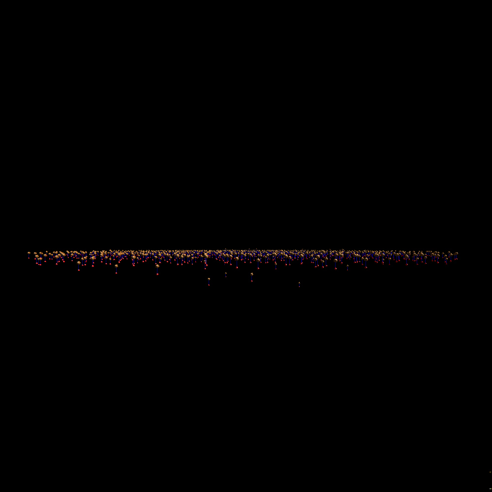
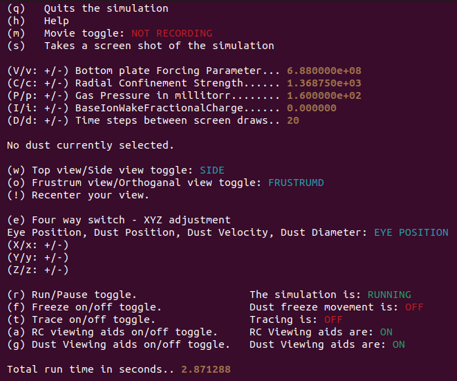

# Interavtive Complex Plasma Crystal Tortions Model

### Table of Contents
- [Selected Pics](#selected-pics)
- [Project Aims](#project-aims)
- [Background](#background)
- [Videos](#videos)
- [Installation](#installation)
- [Building And Running](#building-and-running)
- [Simulation Setup File](#simulation-setup-file)
- [Simulation Runtime Controls](#simulation-runtime-controls)
- [Changelog](#changelog)
- [License](#license)
- [Contributing Authors](#contributing-authors)
- [Funding Sources](#funding-sources)
- [Acknowledgements](#acknowledgements)
- [References](#references)

  
## Selected Pics
### Top View
</img>

### Side View
</img>

  
## Project Aims
Our project has three key objectives:
1. Utilize N-body techniques to simulate 2-D complex plasma crystals.
2. Extend the static point charge model for simulating ion wakes to a dynamic, self-adjusting model.
3. Determine if the new model can replicate phenomena observed in the lab, such as spinning particle pairs.
We hope that the model will help researchers gain a deeper understanding of how dust particles behave in a complex plasma.

## Background 
A complex plasma is a type of plasma that contains nanometer to micron-sized particles, commonly referred to as dust. In typical laboratory conditions, these dust grains tend to accumulate more electrons than ions on their surfaces, resulting in a negative charge. The behavior of these charged dust particles within the plasma environment has significant implications across various fields, including the self-assembly of nanostructures, dust removal in semiconductor fabrication and fusion reactors, and as a mechanism for planet formation in astrophysics.

Experimentalists study the interaction between dust and ion flows in a complex plasma by confining and levitating the charged dust using an electric field. Under specific conditions, the dust particles can spontaneously arrange themselves into highly structured two-dimensional configurations, forming what is known as a complex plasma crystal. The flow of ions in the system creates regions of positive charge downstream of the dust, known as ion wake fields.

This non-Hamiltonian system is believed to be responsible for the emergence of spinning particle pairs, known as torsions, within the crystal. To further understand this mechanism, we have developed a computer model accelerated using NVIDIA GPUs. This model enables one to simulate and study the behavior of complex plasma crystals, providing valuable insights into the dynamics of these systems.

## Videos

Video1 Crystal Formation: 		https://www.youtube.com/watch?v=MXQDr_bA62M  
Video2 Bells and Whistles: 		https://www.youtube.com/watch?v=Tvllwu-McAM  
Video3 Stochastic Action: 		https://www.youtube.com/watch?v=cgIxpmFko5U  
Video4 Static Point Charge: 		https://www.youtube.com/watch?v=NF37KNw5gjM  
Video5 Naive Vanishing Point Charge: 	https://youtu.be/QtZu3ZnpwPU  
Video6 Lifting Dust Grains: 		https://youtu.be/DYISpk_JgEg  
Video7 Classical Torsion: 		https://www.youtube.com/watch?v=2yQZqmFXF1U  
Video8 Crystal and Torsion Forming: 	https://youtu.be/462vpwLTDKI  

## Installation
### Hardware Requirements:
- This simulation requires a CUDA-enabled GPU from Nvidia. Click <a href="https://developer.nvidia.com/cuda-gpus">here </a> for a list of GPUs.

| *Note: These are guidelines, not rules | CPU                            | GPU                   | RAM       |
|----------------------------------------|--------------------------------|-----------------------|-----------|
| Minimum:                               | AMD/Intel Six-Core Processor   | Any CUDA-Enabled GPU  | 16GB DDR4 |
| Recommended:                           | AMD/Intel Eight-Core Processor | RTX 3090/Quadro A6000 | 32GB DDR5 |

### Software Requirements:

#### Disclosure: This simulation only works on Linux-based distros currently. All development and testing was done in Ubuntu 20.04/22.04

#### This Repository contains the following:
- [Nsight Visual Studio Code Edition](https://developer.nvidia.com/nsight-visual-studio-code-edition)
- [CUDA](https://developer.nvidia.com/cuda-downloads)
   - OpenGL
        - [Nvidia Driver For OpenGL](https://developer.nvidia.com/opengl-driver)
        - [OpenGL Index](https://www.khronos.org/registry/OpenGL/index_gl.php)
#### Linux (Ubuntu/Debian)
  Install Nvidia CUDA Toolkit:

    sudo apt install nvidia-cuda-toolkit

  Install Mesa Utils:

    sudo apt install mesa-utils

    
## Building and Running

### Building (Note: this must be done after every code change)

  Navigate to the cloned folder and run the following command to build and compile the simulation:

    ./compile

### Running
  After compiling, run the simulation:

    ./run

    
## Simulation Setup File 
	The simulationSetup file is read in at the start of every simulation. 
	To change constants in the program simply change them in this file before the program is run. 
	You do not need to recompile the code. Be carful not to use the equal sign if you add a coment.
	The code keys in on equal signs to read in constants. 

## Simulation Runtime Controls
  
  

## Changelog

Refer to the changelog for details.

## License
  - This code is protected by the MIT License and is free to use for personal and academic use.

## Contributing Authors
  - Zachary Watson
  - Jorge Martinez Ortiz
  - Samuel Garcia-Rodriguez
  - Katrina Vermillion
  - Parker Adamson
  - Calvin Carmichael
  - Lorin Matthews
  - Truell Hyde
  - Bryant Wyatt

  
## Funding Sources
This research was supported by the NVIDIA cooperation’s Applied Research Accelerator
Program.

## Acknowledgements
We would like to thank Tarleton State University’s Mathematics Department for use of
their High-Performance Computing lab for the duration of this project.

## References
  
	[1] In progress
      

The Particle Modeling Group reserves the right to change this policy at any time.
